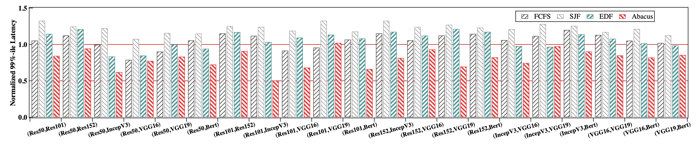

# Abacus

This repository contains the source code for a research paper that was submitted for publication at the [International Conference for High Performance Computing, Networking, Storage, and Analysis](https://sc21.supercomputing.org/) (SC21).

## What is Abacus

**Abacus** is a runtime system that runs multiple DNN queries simultaneously with stable and predictable latency. **Abacus** enables deterministic operator overlap to enforce the latency predictability. **Abacus** is comprised of an overlap-aware latency predictor, a headroom-based query controller, and segmental model executors. The latency predictor is able to precisely predict the latencies of queries when the operator overlap is determined. The query controller determines the appropriate operator overlap to guarantee the QoS of all the DNN services on a GPU. The model executors run the operators as needed to support the deterministic operator overlap. Our evaluation using seven popular DNNs on an Nvidia A100 GPU shows that **Abacus** significantly reduces the QoS violation and improves the throughput compared with state-of-the-art solutions.

## Environment Preparation

- Hardware&software requirements

  1. Hardware Requirements

     1. CPU: Intel(R) Xeon(R) Silver 4210R CPU @ 2.40GHz
     2. Memroy: 252G
     3. NVIDIA Ampere 100

  2. Software Requirements

     1. Ubuntu 20.04.1 (Kernel 5.8.0)
     2. GPU Driver: 460.39
     3. CUDA 11.2
     4. CUDNN 8.1
     5. Anaconda3-2020.7
     6. Pytorch 1.8.0

- Preparing Python environment

  1. Install Anaconda3 as the Python runtime

  ```shell
  $ cd ~ && mkdir -p .local && cd .local
  $ wget -O Anaconda3-2020.07-Linux-x86_64.sh https://repo.anaconda.com/archive/Anaconda3-2020.07-Linux-x86_64.sh
  $ chmod +x Anaconda3-2020.07-Linux-x86_64.sh
  $ ./Anaconda3-2020.07-Linux-x86_64.sh -b -p ../.local/anaconda3
  ```

  2. Activate conda and create python environment with essential dependencies

  ```shell
  $ eval "$($HOME/.local/anaconda3/bin/conda shell.zsh hook)"
  $ # cd into Abacus repository
  $ conda create --name Abacus
  $ pip3 install torch==1.7.1+cu110 torchvision==0.8.2+cu110 -f https://download.pytorch.org/whl/torch_stable.html
  $ pip3 install -r requirements.txt
  ```

  3. Nvidia GPU related affairs: switch MIG and MPS

     - MIG: The new Multi-Instance GPU (MIG) feature allows GPUs based on the NVIDIA Ampere architecture (such as NVIDIA A100) to be securely partitioned into up to seven separate GPU Instances for CUDA applications, providing multiple users with separate GPU resources for optimal GPU utilization.
     - MPS: The MPS runtime architecture is designed to transparently enable co-operative multi-process CUDA applications

     We provide a shell scripts for configuring the MIG and MPS related features on the NVIDIA GPUs. The detailed usage is as follows:

  ```shell
  $ chmod +x nvidia_utils.sh
  $ # switch mig, 0: disable, 1: enable
  $ ./nvidia_utils.sh --mig 0/1
  $ # create GPU instances
  $ ./nvidia_utils.sh --cgi 1/2/4
  $ # delete GPU instances
  $ ./nvidia_utils.sh --dgi
  $ # switch mps with mig disabled, options: start/stop
  $ ./nvidia_utils.sh --mps start/stop
  $ # switch mps with mig enabled, options: start/stop
  $ ./nvidia_utils.sh --mps start/stop --mig 1/2/4
  ```

## Getting Started

The following sections step through the things required to run **Abacus**

### Profiling

**Abacus** needs to profile the essential data for training a precise overlap-aware latency predictor.

We first profiling the data without MPS enabled and MIG disabled.

- Profiling for pair-wise co-location on a dedicated A100.
  ```shell
  $ python main.py --task profile --model_num 2
  ```
- Profiling for triplet-wise co-location on a dedicated A100.
  ```shell
  $ python main.py --task profile --model_num 3
  ```
- Profiling for quadruplet-wise co-location on a dedicated A100.
  ```shell
  $ python main.py --task profile --model_num 4
  ```

We then profiling the data without MPS and MIG both enabled.

- Profiling for pair-wise co-location on a _MIG 2g.10gb_ of A100.
  ```shell
  $ python main.py --task profile --model_num 2 --mig 2
  ```
- Profiling for quadruplet-wise co-location on a _MIG 4g.10gb_ of A100.
  ```shell
  $ python main.py --task profile --model_num 4 --mig 1
  ```

### Training Predictor

After obataining all the profiling data, we train the latency predictor for each cases.

#### Training MLP model

  - Training the predictor for pair-wise co-location on a dedicated A100 for each combination.
    ```shell
    $ python main.py --task train --model_num 2 --mode one by one --modeling mlp
    ```
  - Training the predictor for pair-wise co-location on a dedicated A100 for all combinations.
    ```shell
    $ python main.py --task train --model_num 2 --mode all --modeling mlp
    ```
  - Training the predictor for triplet-wise co-location on a dedicated A100 for all combinations.
    ```shell
    $ python main.py --task train --model_num 3 --mode all --modeling mlp
    ```
  - Training the predictor for quadruplet-wise co-location on a dedicated A100 for all combinations.
    ```shell
    $ python main.py --task train --model_num 4 --mode all --modeling mlp
    ```
  - Training the predictor for pair-wise co-location on a _MIG 2g.10gb_ of A100 for all combinations.
    ```shell
    $ python main.py --task train --model_num 2 --mode all --modeling mlp --mig 2
    ```
  - Training the predictor for quadruplet-wise co-location on a _MIG 4g.20gb_ of A100 for all combinations.

    ```shell
    $ python main.py --task train --model_num 4 --mode all --modeling mlp --mig 1
    ```

#### Training LR/SVM model

  - Training the predictor for pair-wise co-location on a dedicated A100 for all combinations.
    ```shell
    $ python main.py --task train --model_num 2 --mode all --modeling lr/svm
    ```
  - Training the predictor for pair-wise co-location on a dedicated A100 for each combination.

    ```shell
    $ python main.py --task train --model_num 2 --mode one by one --modeling lr/svm
    ```

#### 5.5 Determining Modeling Techniques

  We can get the prediction error from the output in terminal after training the predictor with MLP/LR/SVM models. To get the cross-validation results, we only need to re-train the model because the random seed for generating the dataset is automatically changed.

  We organize the data of errors as shown in `data/modeling/2in7results.csv`.We also provide a script `experiments/5.5_prediction/plot.py` for plot the results.

  The following figure depicts the prediction errors for all modeling methods.

  |                                                                                                 |
  | :--------------------------------------------------------------------------------------------------------------------------------------------------: |
  | **Prediction errors of all the evaluated modeling techniques: Linear Regression, SVM, and MLP. We also show the cross validation accuracy of MLP..** |

### Online Serving

After profiling and training, we can serve multiple DNN services with **Abacus**

- Testing **Abacus** for pair-wise co-location on a dedicated A100, take the setup of `model id: 0, 1; qos_target: 50ms; total tested queries: 1000; search ways: 2` as an example.
  ```shell
  $ python main.py --task serve --model_num 2 --comb 0 1 --policy Abacus --load 50 --qos 50 --queries 1000 --thld 5 --ways 2 --abandon
  ```
- Testing **Abacus** for triplet-wise co-location on a dedicated A100, take the setup of `model id: 0, 1, 3; qos_target: 50ms; total tested queries: 1000; search ways: 2` as an example.
  ```shell
  $ python main.py --task serve --model_num 2 --comb 0 1 2 --policy Abacus --load 50 --qos 50 --queries 1000 --thld 5 --ways 2 --abandon
  ```
- Testing **Abacus** for quadruplet-wise co-location on a dedicated A100, take the setup of `model id: 0, 1, 2, 3; qos_target: 50ms; total tested queries: 1000; search ways: 2` as an example.
  ```shell
  $ python main.py --task serve --model_num 2 --comb 0 1 2 3 --policy Abacus --load 50 --qos 50 --queries 1000 --thld 5 --ways 2 --abandon
  ```
- Testing **Abacus** for pair-wise co-location on a _MIG 2g.10gb_ of A100, take the setup of `model id: 0, 1; qos_target: 50ms; total tested queries: 1000; search ways: 2` as an example.
  ```shell
  $ python main.py --task serve --model_num 2 --comb 0 1 --policy Abacus --load 50 --qos 50 --queries 1000 --thld 5 --ways 2 --abandon --mig 2
  ```
- Testing **Abacus** for pair-wise co-location on a _MIG 4g.20gb_ of A100, take the setup of `model id: 0, 1, 2, 3; qos_target: 50ms; total tested queries: 1000; search ways: 2` as an example.
  ```shell
  $ python main.py --task serve --model_num 2 --comb 0 1 --policy Abacus --load 50 --qos 50 --queries 1000 --thld 5 --ways 2 --abandon --mig 1
  ```

## Evaluation

All evaluations are conducted in the root directory of **Abacus**. The following table presents the detailed information of each experiments, including the corresponding figures in paper and the shell scripts for running the experiment.

|  Experiment Name/ Section/ Paragraph  |  Related Figures   |      Scripts Location      |
| :-----------------------------------: | :----------------: | :------------------------: |
|           7.2 Ensuring QoS            | Figure 14, 15 & 16 |     experiment/7.2_qos     |
|     7.3 Improving Peak Throughput     |     Figure 17      | experiment/7.3_throughput  |
|   7.4 Beyongd Pair-wise Co-location   |   Figure 18 & 19   | experiment/7.4_beyond_pair |
|       7.5 Integrating with MIGs       |   Figure 20 & 21   |     experiment/7.5_mig     |
| 7.6 Applying in a DNN Serving Cluster |     Figure 22      |   experiment/7.6_cluster   |
| 7.7 Effectiveness of Multi-way Search |     Figure 23      |  experiment/7.7_multiway   |

### 7.2 Ensuring QoS

- We first evaluate the QoS guarantee in terms of tail latency and QoS violation ratio.

  ```shell
  # Normal
  $ ./experiments/7.2_qos/2in7.sh
  # Small DNNs
  $ ./experiments/7.2_qos/smalldnn.sh
  ```

  The following figure depicts the 99%-ile latency for each pair-wise co-location.

  |                                                   |
  | :-------------------------------------------------------------------------------------------: |
  | **End-to-end 99%-ile latency of each pair-wise co-location with FCFS, SJF, EDF, and Abacus.** |

  The following two figures depict the QoS violation ratio for each pair-wise co-location and the 99%-ile latency for small DNNs.

  |                                        |      |
  | :------------------------------------------------------------------------------------------: | :----------------------------------------------: |
  | **QoS violation ratio of each pair-wise co-location with<br /> FCFS, SJF, EDF, and Abacus.** | **99%-ile latencies with small co-located DNNs** |

### 7.3 Improving Peak Throughput

- We then evaluate the peak throughput under the load that exceeds the hardware limit.

  ```shell
  $ ./experiments/7.3_throughput/2in7.sh
  ```

  The following figure depicts the peak throughput for each pair-wise co-location.

  |                                                          |
  | :----------------------------------------------------------------------------------------------------------: |
  | **The peak throughput of each co-location pair with FCFS, SJF, EDF, and Abacus while guaranteeing the QoS.** |

### 7.4 Beyongd Pair-wise Co-location

- We also evaluate **Abacus** beyond pair-wise co-location.

  ```shell
  # QoS
  $ ./experiments/7.4_beyond_pair/qos/3in4.sh
  $ ./experiments/7.4_beyond_pair/qos/4in4.sh
  # Throughput
  $ ./experiments/7.4_beyond_pair/throughput/3in4.sh
  $ ./experiments/7.4_beyond_pair/throughput/3in4.sh
  ```

  The following two figures presents the performance of **Abacus** for triplet-wise and quadruplet-wise co-location in terms of QoS guarantee and peak throughput.

  |                                                              |                                                    |
  | :-----------------------------------------------------------------------------------------------------: | :--------------------------------------------------------------------------------------------------: |
  | **The 99%-ile latency in triplets- and quadruplets- wise deployments with FCFS, SJF, EDF, and Abacus.** | **Peak throughputs in triplets- and quadruplets- wise deployments with FCFS, SJF, EDF, and Abacus.** |

### 7.5 Integrating with MIGs

- We also evaluate **Abacus** with MIG enabled.

  ```shell
  # QoS
  $ ./experiments/7.5_mig/qos/1in4.sh
  $ ./experiments/7.5_mig/qos/2in4.sh
  $ ./experiments/7.5_mig/qos/4in4.sh
  # Throughput
  $ ./experiments/7.5_mig/throughput/1in4.sh
  $ ./experiments/7.5_mig/throughput/2in4.sh
  $ ./experiments/7.5_mig/throughput/3in4.sh
  ```

  The following two figures presents the performance of **Abacus** for _MIG 1g.10gb_ and _MIG 2g.20gb_ in terms of QoS guarantee and peak throughput.

|                     |               |
| :-----------------------------------------------------------: | :------------------------------------------------------------: |
| **The 99%-ile latency of the co-located services with MIGs.** | **The peak throughputs of the co-located services with MIGs.** |

### 7.6 Applying in a DNN Serving Cluster

```shell
 # Client
 $ ./experiments/7.6_cluster/client.sh
 # Server
 $ ./experiments/7.6_cluster/server.sh
```

The following figure presents

|                                                           |
| :-----------------------------------------------------------------------------------------------------: |
| **The throughput, 99%-ile latency, and average la- tency of the benchmarks with Abacus and Clockwork.** |

### 7.7 Effectiveness of Multi-way Search

- We also evaluate the effectiveness of multi-way search
  The latency is given while training the MLP model

```shell
$ python main.py --task train --model_num 2 --mode all --modeling mlp
```

|                                           |
| :-----------------------------------------------------------------------------------------: |
| **Duration of determining an appropriate operator group with different search ways.** |


# Acknowledgement
Abacus is collaboratively developed by the EPCC Lab, led by Quan Chen at Shanghai Jiao Tong University, and Lenovo.
We extend our sincere gratitude to Liming Xiao and other contributors from Lenovo for their dedicated support since February 2021. Their pivotal role in shaping the co-location performance model in Abacus—through insightful discussions, significant code contributions, and deep technical expertise—has greatly strengthened the project’s quality, accuracy, and resilience.